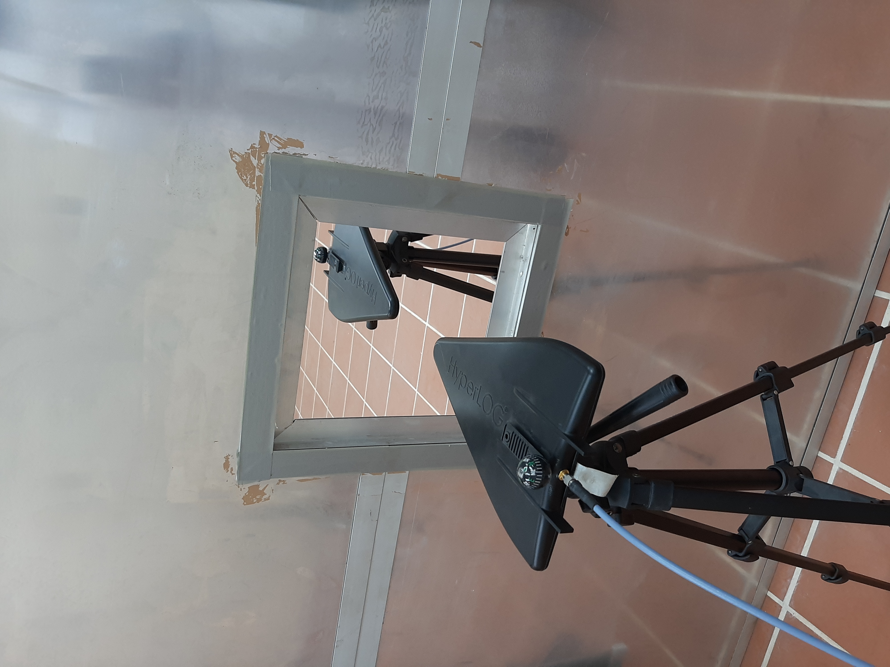
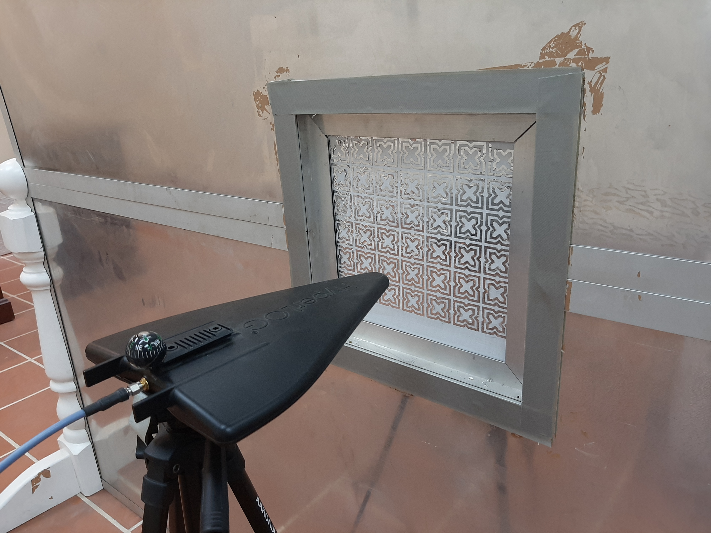

## These folders contain raw measurement data
open.csv are the open window measurements and the rest are with window blinds FSS placed over the window. Subtract them from open measurements to get the shielding plots.

Fabrication

FSS etched on aluminum foil

Measurements:

Open window

Window Blinds

FSS pasted at the back of Window Blinds

Oblique angle measurement

